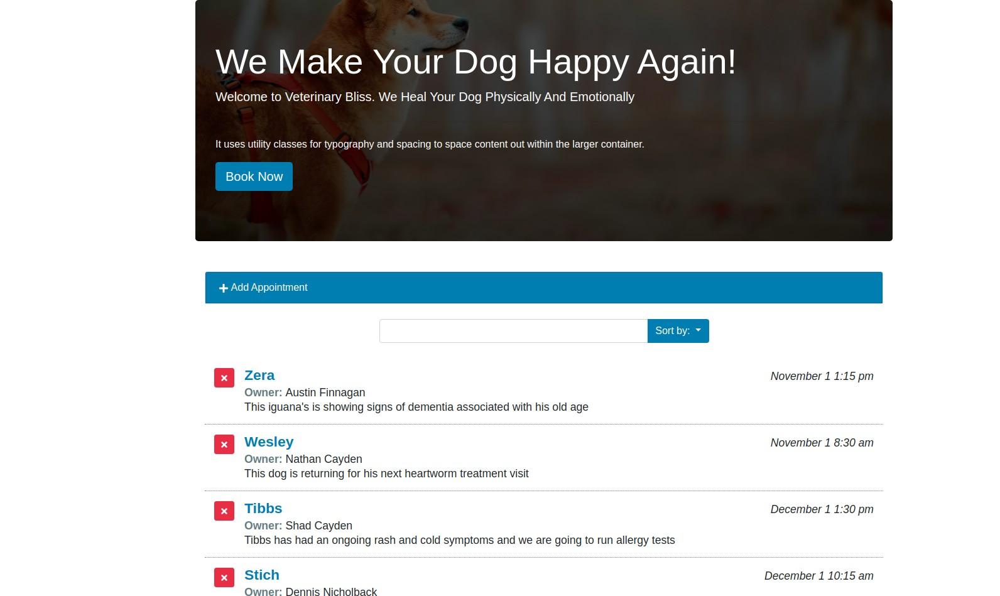

# Building a simple appointment app with React

## Technologies

-React
- HTML
- CSS

## Live Version 
<a href="https://appointdog.netlify.app/" target="_blank" > Live version </a>

## About the Project

This is a  Rea project that mimics a dog veterinary appointment app. The user can book for an appointment for its dog, and later change the content for its appointment (owner name, dog name or description)

## Developed by

Mouhamadou Diouf ( <a href="https://github.com/MouhaDiouf"> @mouhad </a>)

## Contributing

1. Fork it (https://github.com/MouhaDiouf/dog-appointment)
2. Create your feature branch (git checkout -b feature/[choose-a-name])
3. Commit your changes (git commit -am 'What this commit will fix/add')
4. Push to the branch (git push origin feature/[chosen name])
5. Create a new Pull Request
